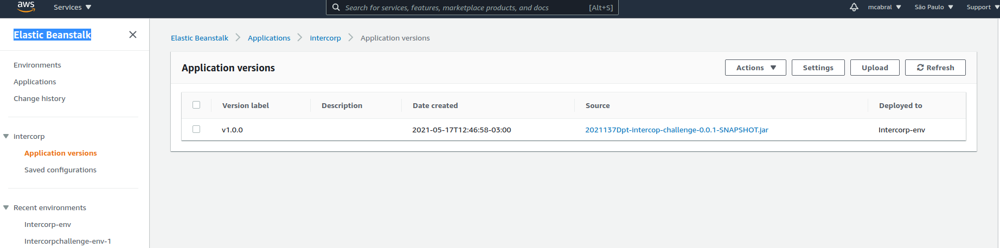

# intercorp-challenge

Implementación del ejercicio propuesto por Itercorp. 

El ejercicio esta descripto en 

## Desarrollo 

```shell
gh repo clone mariocabral/intercorp-challenge
cd intercorp-challenge
./gradlew build
```

Para iniciar el servicio en modo local se debe ejecutar:

```shell
./gradlew bootRun
```

Luego de iniciar el server, se tiene acceso a la documentacino swagger generada: `http://localhost:8080/swagger-ui/`. 

Para ejecutar los test unitarios se debe ejecutar:
```shell
./gradlew check
```


## Deploy  

La aplicación se instalo manualmente usando los siguientes servicios: 

- Elastic Beanstalk
- Amazon RDS, una instancía de Postgres

Se tomo com oreferencia la siguiente [Guia de instalación](https://aws.amazon.com/blogs/devops/deploying-a-spring-boot-application-on-aws-using-aws-elastic-beanstalk/)


## Uso

Se deja adjunto archivo postman que tiene ejemplo de uso local y del servicio alojado en AWS.

En la siguiente imagen se puede ver la version de la aplicación en AWS


Captura de postman usando un servicio:


Captura de la instancia de la DB usada


